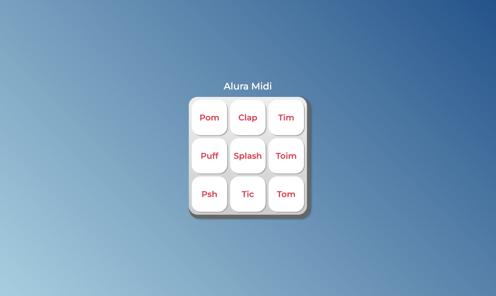

<h1 align = "center"> Alura MIDI <h1>
<h2 align = "center"> By Bieelx <h2>

Este repositório contém o código do projeto 'Alura MIDI' feito a partir do curso JavaScript para Web: Crie páginas dinâmicas da alura. 

## 🚀 Tecnologias

Esse projeto foi desenvolvido com as seguintes tecnologias:
- JavaScript

# Alura-Midi
